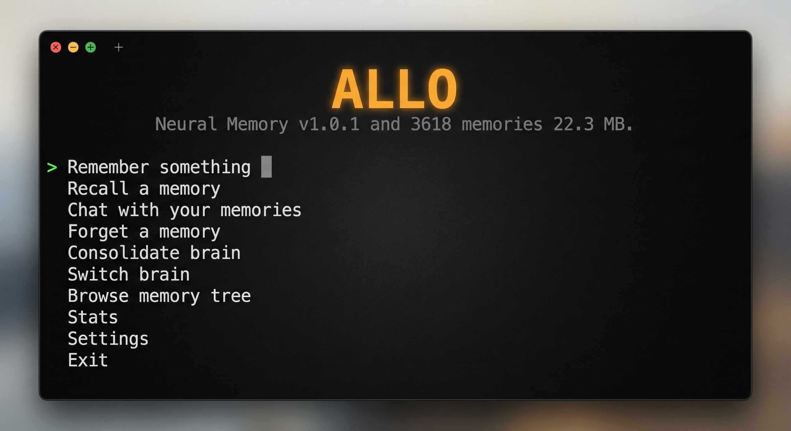

# Allo

**Neural memory for humans and AI agents.**

[](https://www.npmjs.com/package/@terronex/allo)
[](https://github.com/Terronex-dev/engram)
[](https://opensource.org/licenses/MIT)



Allo stores memories in a single `.engram` file, retrieves them by meaning using semantic search, and curates them over time with temporal decay. Recent memories stay vivid. Old ones fade to summaries. Duplicates merge automatically.

Built on [@terronex/engram](https://github.com/Terronex-dev/engram) and [@terronex/engram-trace-lite](https://github.com/Terronex-dev/engram-trace-lite).

## Engram V2 — Graph Features

Allo now supports Engram V2 graph capabilities:

- **Typed Links** — Connect memories with meaning (`supports`, `contradicts`, `follows`)
- **Graph Traversal** — Find paths and neighborhoods between memories
- **Auto-Linking** — Automatically discover related memories by similarity
- **Confidence Scores** — Track memory reliability

```typescript
const graph = allo.getGraph();
graph.autoLinkSimilar(0.85);                    // Auto-link similar memories
const related = graph.getLinkedNodes(memoryId); // Get connected memories
const path = graph.findPath(startId, endId);    // Find reasoning chain
```

## V2.1 — Spatial Intelligence

Find memories by location, not just meaning:

```typescript
// Set positions on memories
await allo.setPosition(memoryId, { x: 48.8566, y: 2.3522 }); // Paris lat/lon

// Find memories within 500km
const nearby = await allo.spatialRecall(
  { x: 48.8566, y: 2.3522 },
  500,
  { metric: 'haversine' }
);

// Hybrid: semantic + spatial
const results = await allo.spatialRecall(
  { x: 40.7128, y: -74.0060 },  // NYC
  100,
  { metric: 'haversine', query: 'coffee shops' }
);

// Find memories near another memory
const related = await allo.findNearby(memoryId, 10);
```

## Install

```bash
npm install -g @terronex/allo
```

Requires Node.js 18+. First run walks you through provider setup.

## Quick Start

```bash
# Interactive menu
allo

# Remember something
allo remember "HNSW indexing gives us 400x faster search"

# Recall by meaning
allo recall "fast search algorithms"

# Chat with your memories (requires LLM provider)
allo chat

# Browse your memory tree
allo browse
```

## CLI Reference

| Command | Description |
|---------|-------------|
| `allo` | Interactive menu |
| `allo remember [text]` | Add a text memory |
| `allo remember-file <path>` | Add a file memory (images, audio, docs) |
| `allo recall <query>` | Semantic search with interactive detail view |
| `allo chat` | Chat with your memories using an LLM |
| `allo browse` | Browse memories by tag, date, tier, or hierarchy |
| `allo consolidate` | Run memory consolidation (decay, dedup, cluster) |
| `allo forget <query>` | Semantically forget matching memories |
| `allo stats` | Brain health report with tier distribution |
| `allo setup` | Configure LLM providers |
| `allo demo` | Guided demo |

### Common Options

```
-f, --file <path>     Use a specific .engram file
-t, --tags <tags>     Comma-separated tags
-p, --parent <id>     Parent memory ID (builds hierarchy)
-l, --limit <n>       Max recall results (default: 8)
-b, --brief           Compact output without interactive selection
--persona <name>      Chat as a persona (with --file for brain)
```

## Recall

Recall uses semantic search -- it matches meaning, not keywords:

```bash
$ allo recall "budget approval"

Found 3 memories:

  1. [HOT] 87%  Meeting with Sarah went well, she approved the Q3 budget    Jun 14
  2. [WARM] 62% Q3 planning started, budget discussions ongoing              May 28
  3. [COLD] 41% Annual budget process kicks off in April                     Apr 2

View [1-3], or Enter to go back:
```

Select a number to see full detail:

```
  ──────────────────────────────────────────────────────────────
  Memory #1 -- mlz6n0rl-84raep-00t8
  ──────────────────────────────────────────────────────────────
  Relevance:   87%
  Tier:        [HOT] (decay in ~14 days)
  Type:        text
  Created:     Sat, Jun 14, 2026, 2:30 PM
  Modified:    Sat, Jun 14, 2026, 2:30 PM
  Accessed:    3 times, last Mon, Jun 16, 2026, 9:15 AM
  Importance:  0.80  Confidence: 0.80  Source: direct
  Tags:        work, budget
  Words:       12
  ──────────────────────────────────────────────────────────────
  Meeting with Sarah went well, she approved the Q3 budget
  ──────────────────────────────────────────────────────────────
```

## Memory Browser

Browse your memories interactively by tag, date, tier, or parent-child hierarchy:

```bash
allo browse
```

- **By tag** -- see all tags with counts, select to explore
- **By date** -- memories grouped by day
- **By tier** -- filter hot, warm, cold, or archive
- **Recent** -- latest 25 memories
- **Tree view** -- parent-child hierarchy (use `--parent <id>` when remembering to build trees)

Paginated with prev/next navigation. Select any memory to see its full detail card.

## Temporal Decay

Memories age through four tiers based on the Ebbinghaus forgetting curve:

| Tier | Default Age | Behavior |
|------|-------------|----------|
| HOT | 0--7 days | Full detail, boosted in search |
| WARM | 7--30 days | Full detail, normal ranking |
| COLD | 30--365 days | Candidates for summarization |
| ARCHIVE | 365+ days | Truncated to 200 chars, still searchable by embedding |

Accessing a memory slows its decay (0.5 days per access, max 5 days). High-importance memories decay up to 3x slower.

### Consolidation

Run `allo consolidate` to curate your brain:

1. **Decay** -- age memories through tiers based on time and access
2. **Deduplicate** -- remove near-identical entries (cosine similarity > 0.92)
3. **Cluster** -- group related memories (similarity > 0.78, min 3 per cluster)
4. **Summarize** -- LLM collapses clusters into condensed entries (optional, requires LLM)
5. **Archive** -- truncate ancient content

Consolidation works without an LLM. Phases 1, 2, and 5 are pure math. LLM is only needed for summarization.

### Auto-dedup

When adding memories with `addText()`, Allo automatically checks for near-duplicates (cosine similarity > 0.92). If a match is found, the existing memory is refreshed instead of creating a duplicate.

## Persona Mode

Load any `.engram` brain file as read-only and chat as that person:

```bash
allo chat --file ~/.allo/brains/tesla.engram --persona "Nikola Tesla"
```

The LLM receives the brain's content as context and responds in character. Works with any brain file -- historical figures, domain experts, project knowledge bases.

## Providers

Allo uses local embeddings by default (no API key needed). LLM providers are optional, used for chat and smart consolidation.

| Provider | Embeddings | Chat | Auth |
|----------|-----------|------|------|
| Local (default) | Xenova/all-MiniLM-L6-v2 | -- | None |
| Ollama | nomic-embed-text | Any local model | None |
| Anthropic | -- | Claude | API key or OAuth |
| OpenAI | -- | GPT-4o | API key |
| Google | -- | Gemini | API key |

Anthropic OAuth tokens (`sk-ant-oat-*`) are auto-detected during setup.

### Switching Models

Switch LLM or embedding models on the fly from the interactive menu:

```bash
allo
# Settings > Switch LLM > pick a model
# Settings > Switch embeddings > pick a model
```

- Auto-detects installed Ollama models
- Lists current Anthropic, OpenAI, and Google models
- Add API keys inline without re-running full setup
- Shows which model is active, greys out providers without keys
- Config saved immediately -- no restart needed

## Programmatic API

```typescript
import { Allo } from '@terronex/allo';

const brain = new Allo({
  memoryFile: 'agent-brain.engram',
  password: 'optional-encryption-passphrase',
});

await brain.initialize();

// Store
const id = await brain.addText('Deadline is March 15th', undefined, ['work']);
await brain.addFile('./diagram.png', 'Architecture diagram', id);

// Recall
const results = await brain.recall('when is the deadline?');
// [{ content: 'Deadline is March 15th', tier: 'hot', score: 0.87, ... }]

// Browse
const all = brain.getAll();

// Consolidate
const report = await brain.consolidate();
// { decayed: 12, deduplicated: 3, clustersFound: 2, ... }

// Forget
const count = await brain.forget('sensitive topic');

// Save
await brain.save();
```

### AlloMemory Interface

```typescript
interface AlloMemory {
  id: string;
  type: string;           // text, image, audio, code, summary
  content: string;
  timestamp: number;       // created
  modified: number;
  lastAccessed: number;
  accessed: number;        // access count
  tags: string[];
  score?: number;          // relevance (0-1) from recall
  tier: 'hot' | 'warm' | 'cold' | 'archive';
  parentId: string | null;
  depth: number;
  importance: number;      // 0-1
  confidence: number;      // 0-1
  source: string;          // 'direct', 'inferred', etc.
  wordCount: number;
}
```

## Configuration

Stored in `~/.allo/config.json`. Created by `allo setup` or first run.

```json
{
  "embeddings": { "provider": "local", "model": "Xenova/all-MiniLM-L6-v2" },
  "llm": { "provider": "anthropic", "model": "claude-sonnet-4-20250514" },
  "keys": { "anthropic": "sk-ant-..." },
  "ollamaUrl": "http://localhost:11434",
  "memoryFile": "~/allo-memory.engram"
}
```

Brains directory: `~/.allo/brains/` (auto-discovered by browse and switch commands).

## Performance

Tested against a production brain (4,076 memories, 26 MB, 448 real conversation sessions):

| Metric | Value |
|--------|-------|
| Recall accuracy | 96.5% across 399 diverse queries |
| Average latency | 1.6 ms |
| P95 latency | 2 ms |
| P99 latency | 7 ms |
| Throughput | 609 queries/sec |
| Adversarial robustness | 100% (zero crashes on 30 edge cases) |

Embedding model: Xenova/all-MiniLM-L6-v2 (384 dimensions). Search uses brute-force cosine similarity for brains under 100 nodes, HNSW approximate nearest neighbor for larger brains.

## Architecture

```
CLI / Interactive Menu
        |
    Allo Core
    addText / addFile / recall / forget / consolidate / browse
        |
    Providers (Anthropic, OpenAI, Gemini, Ollama)
        |
    @terronex/engram (MemoryTree, HNSW, temporal decay)
    @terronex/engram-trace-lite (consolidation pipeline)
        |
    .engram file (single portable binary)
```

## Ecosystem

Allo is part of the Engram ecosystem:

- **[@terronex/engram](https://github.com/Terronex-dev/engram)** -- Neural memory format library (NPM)
- **[@terronex/engram-trace](https://github.com/Terronex-dev/engram-trace)** -- Autonomous memory intelligence for agents
- **[@terronex/engram-trace-lite](https://github.com/Terronex-dev/engram-trace-lite)** -- Stateless consolidation functions
- **[Rex](https://github.com/Terronex-dev/rex)** -- Terminal AI agent with persistent Engram memory (coming soon)

## License

MIT -- [Terronex](https://terronex.dev) 2026


## Disclaimer

This software is provided as-is under the MIT license. It is under active development and has not undergone a third-party security audit. The encryption implementation (AES-256-GCM with argon2id/PBKDF2) has not been independently verified.

Do not use this software as the sole protection for sensitive data without your own due diligence. The authors and Terronex are not liable for data loss, security breaches, or any damages arising from the use of this software. See LICENSE for full terms.
